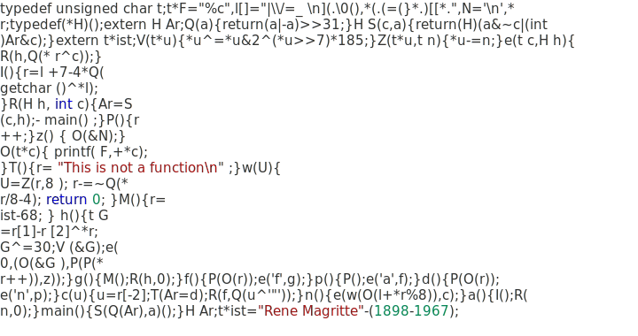

<p align="center">
	
</p>

# this-is-not-a-function

This is an SVG of Uri Goren's 20th [International Obfuscated C Code Contest (2011) entry](https://www.ioccc.org/years.html). It uses a modified version of Visual Studio's color theme and [Cascadia Code/Mono](https://github.com/microsoft/cascadia-code), with Consolas and monospace as fallback.

To compile [`goren.c`](https://www.ioccc.org/2011/goren/goren.c) in 2021, you can use this command:
```shell
wget https://www.ioccc.org/2011/goren/goren.c
gcc -ansi -O2 -m32 -o goren goren.c
```
Note that it works only in 32 bit mode, since it depends on the size of pointers, according to the [author's hints](https://www.ioccc.org/2011/goren/hint.text). So you might to install `gcc-multilib` to have `-m32` available on your machine.

Once you have it working, you can try to ask it surreal questions, like:
```shell
echo 'If | is just a representation of a pipe, then how can data stuff it?' | ./goren
```

or
```shell
echo '| is just a representation of a pipe because I say so! So stuff it!' | ./goren
```


### License
The SVG is licensed under the [UNLICENSE](https://choosealicense.com/licenses/unlicense/). The code itself is licensed under the respective license of the author.
